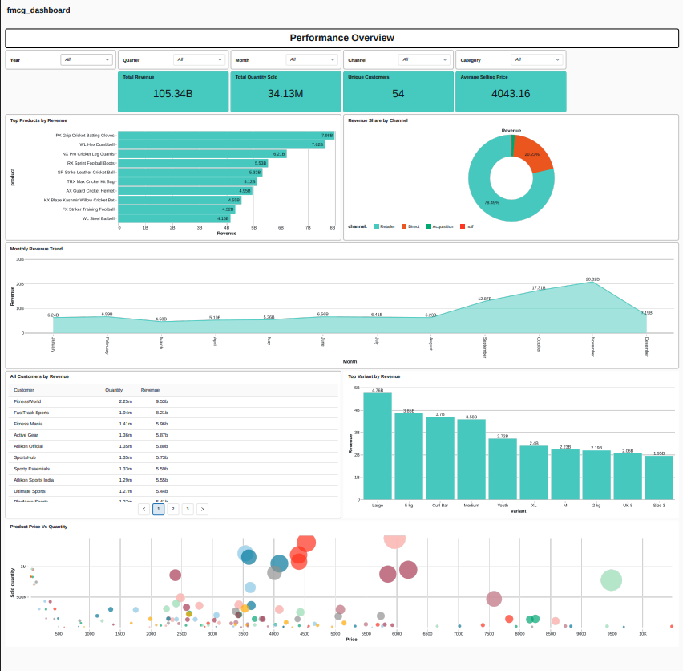

# 🚀 FMCG ETL Data Engineering Pipeline

An end-to-end Data Engineering project built using **Databricks Free Edition**, following the **Medallion Architecture (Bronze → Silver → Gold)** to solve a real-world FMCG business use case.

This project simulates a scenario where a large FMCG retail company acquires a smaller company and needs to consolidate data from both organizations into a unified Lakehouse. The pipeline ingests raw data, performs data cleansing and transformation using PySpark, stores curated data in Delta Lake, and provides interactive business insights through a Databricks Lakeview Dashboard.

---

## 📌 Business Problem

A large FMCG retail company has acquired a smaller company. Since both companies maintain their own sales, customer, and product databases, business teams cannot generate consolidated reports.

This project builds an ETL pipeline to:

- Consolidate data from both companies
- Standardize inconsistent data
- Create a single source of truth
- Generate analytics-ready datasets
- Visualize business insights through interactive dashboards

---

# 🏗️ Architecture

```
                Source Data (CSV Files)
                        │
                        ▼
                 Amazon S3 Storage
                        │
                        ▼
            Databricks + PySpark ETL
                        │
        ┌───────────────┼───────────────┐
        ▼               ▼               ▼
     Bronze          Silver          Gold
   (Raw Data)   (Cleaned Data)  (Business Ready)
                        │
                        ▼
              Delta Lake Tables
                        │
                        ▼
          Lakeview BI Dashboard
```

---

# 🏛 Medallion Architecture

### 🥉 Bronze Layer
- Raw data ingestion from both companies
- No transformations
- Historical data preserved

### 🥈 Silver Layer
- Data Cleaning
- Remove duplicates
- Handle null values
- Date standardization
- Correct inconsistent city names
- Data quality validations

### 🥇 Gold Layer
- Business-ready analytical tables
- Fact and Dimension modeling
- Optimized for reporting
- Interactive Dashboard

---

# 🛠 Tech Stack

| Technology | Purpose |
|------------|---------|
| Python | Programming |
| PySpark | Data Transformation |
| Spark SQL | Query Processing |
| Databricks | Data Engineering Platform |
| Delta Lake | Lakehouse Storage |
| Amazon S3 | Data Storage |
| SQL | Data Analysis |
| Git & GitHub | Version Control |
| Lakeview Dashboard | Business Intelligence |

---

# 📂 Project Structure

```
fmcg-etl-data-engineering-pipeline/
├── 0_data/
│   ├── 1_parent_company/
│   └── 2_child_company/
│
├── 1_setup/
│   ├── setup_catalog.ipynb
│   ├── dim_date_table_creation.ipynb
│   └── utilities.ipynb
│
├── 2_dimension_data_processing/
│   ├── 1_customer_data_processing.ipynb
│   ├── 2_products_data_processing.ipynb
│   └── 3_pricing_data_processing.ipynb
│
├── 3_fact_data_processing/
│   ├── 1_full_load_fact.ipynb
│   └── 2_incremental_load_fact.ipynb
│
├── dashboards/
│   ├── fmcg_dashboard.png
│   ├── fmcg_dashboard.pdf
│   └── AtliQon_360_BI_Dashboard.lvdash.json
│
└── architecture/
    └── medallion_architecture.png
```

---

# ⚙️ ETL Pipeline

### Step 1

Ingest raw CSV files from Amazon S3.

↓

### Step 2

Load data into Bronze Delta Tables.

↓

### Step 3

Clean data in Silver Layer

- Handle Null Values
- Remove Duplicates
- Standardize Dates
- Standardize City Names
- Type Casting
- Data Validation

↓

### Step 4

Create Gold Layer

- Fact Orders
- Customer Dimension
- Product Dimension
- Date Dimension

↓

### Step 5

Generate Business Dashboard

---

# 📊 Dashboard Features

The Lakeview Dashboard provides:

- 📈 Total Revenue
- 📦 Total Quantity Sold
- 👥 Unique Customers
- 💰 Average Selling Price
- 🥧 Revenue by Channel
- 📊 Monthly Revenue Trend
- 🏆 Top Products by Revenue
- 📋 Customer Revenue Table
- 📉 Product Price vs Quantity
- Interactive Filters
  - Year
  - Quarter
  - Month
  - Category
  - Channel

---

## 📊 Dashboard



---

# ✨ Key Features

- End-to-End ETL Pipeline
- Medallion Architecture
- Delta Lake
- Delta Merge Operations
- Schema Evolution
- Data Validation
- Data Cleaning
- Slowly Changing Data Handling
- Interactive BI Dashboard
- Version Controlled using Git

---

# 📚 Skills Demonstrated

- Data Engineering
- PySpark
- Spark SQL
- Delta Lake
- Data Cleaning
- Data Modeling
- ETL Development
- Lakehouse Architecture
- Dashboard Development
- Git & GitHub

---


# 👨‍💻 Author

**Shivam Jaiswal**

LinkedIn: https://www.linkedin.com/in/shivam-kumar0525/

GitHub: https://github.com/shivamjais25

---

# ⭐ If you found this project useful

Please consider giving this repository a ⭐ on GitHub!
